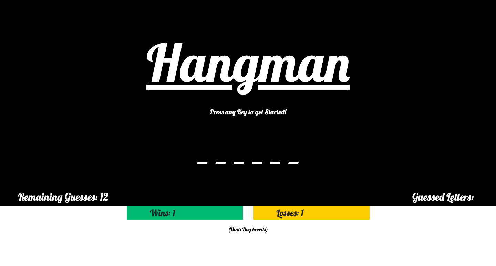
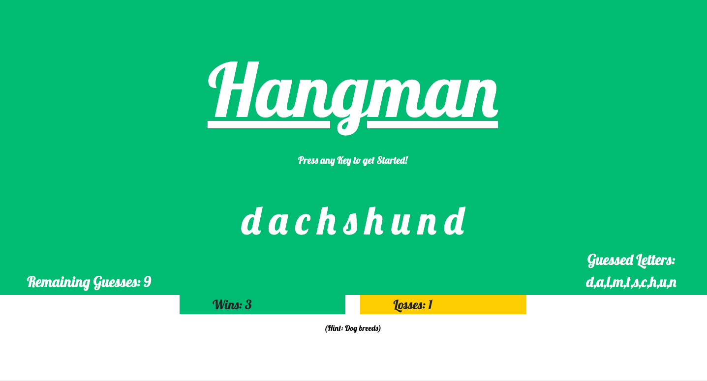
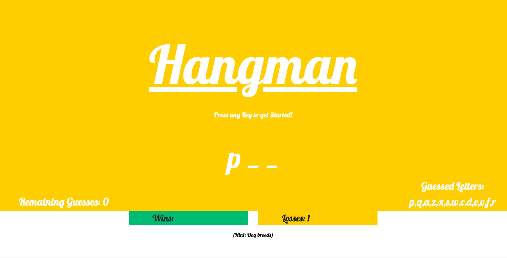

# Word-Guess-Game

## Pictures of Site
Initial page:

Page when a player wins:

Page when a player loses: 

## Description of Site
A hangman game for the purpose of:  
1. Practicing newly learned skills in javascript

## Technologies Used
1. HTML 
2. CSS
3. Bootstrap
4. Javascript
5. jQuery

## Author(s): [Minori Hashimoto](https://github.com/minori-fh)
